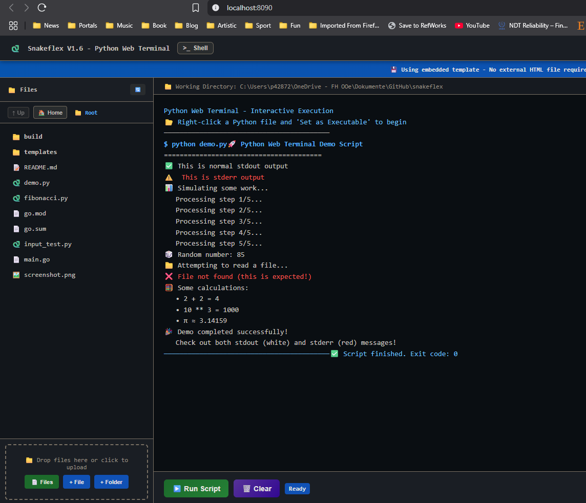

# 🐍 SnakeFlex

*A modern web-based Python development environment that just works.*

Run any Python script in your browser with real-time output, interactive input support, and comprehensive file management. No modifications to your code required.

## ✨ What it does

SnakeFlex creates a beautiful web-based development environment for Python scripts. Think of it as your IDE and terminal combined, but accessible from anywhere with a web browser.

* 🌐 **Universal compatibility** - Works with any Python script without code changes
* 📂 **File manager** - Browse, upload, download, and manage files with drag & drop
* 💬 **Interactive input** - Handle `input()` calls seamlessly
* ⚡ **Real-time output** - See your script's output as it happens
* 🎨 **Modern UI** - GitHub-inspired dark interface with resizable panels
* 🔒 **Security modes** - Full-featured or secure terminal-only mode
* 🔄 **Cross-platform** - Windows, macOS, and Linux support
* 🚀 **Zero setup** - Just point it at your Python file and go

## 🚀 Quick Start

### Option 1: Run directly with Go

```bash
git clone https://github.com/Sinamirshahi/snakeflex
cd snakeflex
go mod tidy
go run main.go --file your_script.py
```

### Option 2: Build and run

```bash
git clone https://github.com/Sinamirshahi/snakeflex
cd snakeflex
go mod tidy
go build -o snakeflex
./snakeflex --file your_script.py
```

### Option 3: Build for different platforms

```bash
# Windows
GOOS=windows GOARCH=amd64 go build -o snakeflex.exe

# macOS
GOOS=darwin GOARCH=amd64 go build -o snakeflex-macos

# Linux
GOOS=linux GOARCH=amd64 go build -o snakeflex-linux
```

**Then open your browser:**

```
http://localhost:8090
```

**Browse files in the left panel, click "Run Script" and watch the magic happen** ✨

## 📋 Usage

### With Go (development)

```bash
# Basic usage (full file manager)
go run main.go --file script.py

# Secure mode (terminal only)
go run main.go --file script.py --disable-file-manager

# Custom port
go run main.go --file script.py --port 3000

# Production deployment with security
go run main.go --file script.py --port 8080 --disable-file-manager

# Custom template
go run main.go --file script.py --template custom.html

# Verbose logging
go run main.go --file script.py --verbose
```

### With built binary (production)

```bash
# After building with: go build -o snakeflex
./snakeflex --file script.py
./snakeflex --file script.py --port 3000
./snakeflex --file script.py --disable-file-manager --verbose

# Windows
snakeflex.exe --file script.py
snakeflex.exe --file script.py --disable-file-manager
```

### Command Line Options

| Flag                     | Default         | Description                                    |
| ------------------------ | --------------- | ---------------------------------------------- |
| `--file`                 | `fibonacci.py`  | Python script to execute                      |
| `--port`                 | `8090`          | Server port                                    |
| `--template`             | `terminal.html` | HTML template file                             |
| `--verbose`              | `false`         | Enable detailed logging                        |
| `--disable-file-manager` | `false`         | Disable file management for enhanced security  |

## 🔒 Security Modes

SnakeFlex offers two operational modes to balance functionality with security:

### **🛡️ Secure Mode** (`--disable-file-manager`)
Perfect for production environments, shared systems, or when you need maximum security:

* ✅ **Terminal functionality** - Full Python script execution with interactive input
* ✅ **Real-time output** - All terminal features work normally  
* ❌ **File operations** - Upload, download, create, delete disabled
* ❌ **File browsing** - Directory listing disabled
* ❌ **API endpoints** - All `/api/files/*` routes disabled
* 🔒 **Zero attack surface** - File management completely removed

```bash
# Production deployment
./snakeflex --file production_script.py --disable-file-manager --port 8080

# Educational environment (students can't modify files)
./snakeflex --file lesson.py --disable-file-manager

# Container deployment
docker run -p 8090:8090 snakeflex --file app.py --disable-file-manager
```

### **📂 Full Mode** (default)
Complete development environment with all features:

* ✅ **All terminal functionality**
* ✅ **Complete file management**
* ✅ **Drag & drop uploads**
* ✅ **File browsing and organization**
* 🔒 **Secure within working directory**

## 📂 File Management Features

*Available in Full Mode only. Use `--disable-file-manager` to disable for security.*

SnakeFlex includes a comprehensive file manager in the left sidebar:

### **📁 File Operations**
* **Browse files** - Tree view of your working directory
* **Upload files** - Drag & drop or click to upload multiple files
* **Download files** - One-click download for any file
* **Create files/folders** - Built-in creation dialog
* **Delete files/folders** - Safe deletion with confirmation
* **File icons** - Visual file type indicators (🐍 .py, 🌐 .html, 📄 .txt, etc.)

### **🎛️ Interface Features**
* **Resizable sidebar** - Drag the edge to adjust panel width
* **Context menus** - Right-click files for quick actions
* **Real-time updates** - File list refreshes automatically
* **Security protection** - Prevents access outside working directory

### **API Endpoints** (Full Mode Only)
* `GET /api/files` - Browse directory contents
* `GET /api/files/download?path=file.py` - Download files
* `POST /api/files/upload` - Upload multiple files
* `POST /api/files/create` - Create new files/folders
* `DELETE /api/files/delete?path=file.py` - Delete files/folders

*Note: These endpoints return 403 Forbidden when file management is disabled.*

## 🎯 Perfect for

### **Development & Education** (Full Mode)
* **Education** - Teaching Python with file management in a browser
* **Demos** - Showing off projects with easy file sharing
* **Remote development** - Full file management without SSH
* **Data science** - Upload datasets, run scripts, download results
* **Workshops** - Students can upload their work and test scripts

### **Production & Security** (Secure Mode)
* **Production deployment** - Secure Python script execution
* **Shared environments** - Multiple users without file access risks
* **Container deployment** - Minimal attack surface
* **Corporate environments** - Compliant with security policies
* **Educational restrictions** - Students can run code but not modify files
* **Public demos** - Safe script execution without file system access

## 📦 Distribution

SnakeFlex compiles to a single binary with no dependencies (except Python on the target system). Perfect for:

* **Sharing demos** - Send the binary + your Python scripts
* **Educational environments** - Complete development environment in one binary
* **Client presentations** - Professional Python script demonstrations with file management
* **Remote execution** - Lightweight server for Python development
* **Workshop distribution** - One-click setup for coding workshops
* **Secure deployment** - Production-ready with security controls

```bash
# Build for your platform
go build -o snakeflex

# Development package (full features)
mkdir my-python-workspace
cp snakeflex my-python-workspace/
cp *.py my-python-workspace/
cp terminal.html my-python-workspace/
cp -r data/ my-python-workspace/  # Include data directories

# Production package (secure mode)
mkdir secure-deployment
cp snakeflex secure-deployment/
cp production_script.py secure-deployment/
cp terminal.html secure-deployment/
echo './snakeflex --file production_script.py --disable-file-manager --port 8080' > secure-deployment/start.sh
chmod +x secure-deployment/start.sh

# Package and distribute
zip -r python-workspace.zip my-python-workspace/
zip -r secure-deployment.zip secure-deployment/
```

## 🔧 How it works

SnakeFlex uses WebSockets for real-time bidirectional communication between your browser and Python process, plus a REST API for file management operations (when enabled). It automatically detects when your script needs input and presents a clean interface for interaction.

The Go server intelligently detects your system's Python installation (`python`, `python3`, or `py`) and runs scripts with proper buffering settings to ensure real-time output. File operations are secured to prevent access outside the working directory, and can be completely disabled for maximum security.

**Architecture:**
* **WebSocket connection** - Real-time terminal communication
* **REST API** - File management operations (optional)
* **Security layer** - Path validation, access control, and feature disabling
* **Multi-platform support** - Adaptive Python detection

## 🎨 Features in action

**Interactive input detection:**

```python
name = input("What's your name? ")  # Input box appears automatically
age = int(input("How old are you? "))  # Handles any input type
```

**Real-time output:**

```python
import time
for i in range(5):
    print(f"Processing step {i+1}...")
    time.sleep(1)  # You see each line as it prints
```

**File operations** (Full Mode only):

```python
# Upload data.csv through the file manager
import pandas as pd
df = pd.read_csv('data.csv')  # File is now available to your script
print(df.head())

# Results can be saved and downloaded
df.to_csv('results.csv')  # Use file manager to download results
```

**Error handling:**

```python
print("This goes to stdout")
print("This goes to stderr", file=sys.stderr)  # Different colors
raise Exception("Errors are highlighted")
```

### 🖼️ Screenshot



*Interface showing file manager panel (Full Mode) and secure terminal-only mode*

## 🔧 Requirements

### For building:

* **Go 1.21+** - For compiling the server
* **Git** - For cloning the repository

### For running (built binary):

* **Python 3.x** - Any Python 3 installation
* **Modern browser** - Chrome, Firefox, Safari, Edge

*Note: The built binary has no Go dependencies and can run on any system with Python.*

## 📦 Dependencies

* `github.com/gorilla/websocket` - WebSocket support for terminal communication

## 🔒 Security Features

SnakeFlex includes comprehensive security measures:

### **Always Active Security**
* **Path validation** - Prevents directory traversal attacks
* **Working directory restriction** - File operations limited to project folder
* **Protected files** - Currently executing Python file cannot be deleted
* **Input sanitization** - All file paths and operations are validated
* **Safe uploads** - File uploads are restricted to working directory

### **Enhanced Security Mode** (`--disable-file-manager`)
* **Eliminated attack surface** - File management endpoints completely removed
* **API endpoint disabling** - All `/api/files/*` routes return 403 Forbidden
* **UI adaptation** - Interface clearly shows secure mode status
* **Defense in depth** - Multiple layers of validation even when disabled
* **Production ready** - Suitable for corporate and shared environments

### **When to Use Secure Mode**
* ✅ **Production deployments** - Reduce attack surface in live environments
* ✅ **Shared systems** - Multiple users without file access risks
* ✅ **Educational restrictions** - Students can execute but not modify files
* ✅ **Container deployment** - Minimal security footprint
* ✅ **Corporate compliance** - Meet security policy requirements
* ✅ **Public demos** - Safe script execution without file system access

## 🤝 Contributing

Found a bug? Have an idea? Pull requests are welcome!

1. Fork the project
2. Create your feature branch (`git checkout -b feature/amazing-feature`)
3. Commit your changes (`git commit -m 'Add amazing feature'`)
4. Push to the branch (`git push origin feature/amazing-feature`)
5. Open a Pull Request

## 🐛 Known limitations

* Windows doesn't support full PTY (pseudo-terminal) features
* Very long-running scripts might timeout in some browsers
* File I/O operations in Python scripts access the server's filesystem
* Large output bursts are throttled to prevent WebSocket flooding
* File uploads are limited to 32MB by default (Full Mode only)
* Hidden files and system directories (`.git`, `__pycache__`) are filtered from the file browser
* Secure mode completely disables file management - no partial restrictions

## 💡 Pro tips

### Terminal Tips (Both Modes)
* Use `print(..., flush=True)` for immediate output in custom scripts
* Press `Ctrl+C` in the terminal to stop long-running scripts
* Check the browser console (F12) for debugging WebSocket issues
* Use `--verbose` flag to debug script execution and input handling

### File Management Tips (Full Mode Only)
* **Drag and drop** files directly into the upload area for quick uploads
* **Right-click files** to access download and delete options
* **Resize the sidebar** by dragging the right edge for more space
* **Use the refresh button** (🔄) to update the file list after external changes
* **Create folders first**, then upload files to organize your workspace
* **Download results** after running data processing scripts

### Security Tips
* **Use `--disable-file-manager`** for production deployments
* **Test in Full Mode**, deploy in Secure Mode for safety
* **Monitor logs** with `--verbose` in secure environments
* **Container isolation** - Run in Docker for additional security layers
* **Network restrictions** - Use firewall rules to limit access

### Development Tips
* Built binaries are portable - no Go installation needed on target machines
* Multiple concurrent output streams are handled safely (stdout + stderr)
* File operations provide real-time feedback in the terminal (Full Mode)
* The current Python script file is protected from accidental deletion
* Secure mode provides the same terminal experience with zero file management risk

## 🎉 Acknowledgments

Inspired by the need for a complete, browser-based Python development environment that works everywhere while maintaining security flexibility. Built with love for the Python community and educators who need powerful, accessible, and secure tools.

## 🗺️ Roadmap

### **Near Term**
* 📝 **Inline file editing** - Edit files directly in the browser (Full Mode)
* 🎨 **Syntax highlighting** - Code highlighting for Python files
* 🔍 **File search** - Quick file finding in large projects

### **Future Enhancements**
* 📁 **Folder navigation** - Navigate into subdirectories
* 💾 **Project templates** - Quick-start templates for common tasks
* 🌍 **Multi-user support** - Collaborative development features
* 🔐 **Authentication** - User login and access control
* 📊 **Usage analytics** - Security and performance monitoring
* 🐳 **Docker images** - Pre-built containers for easy deployment

---

*Made with ❤️ and ☕. Secure by design, powerful by choice.*